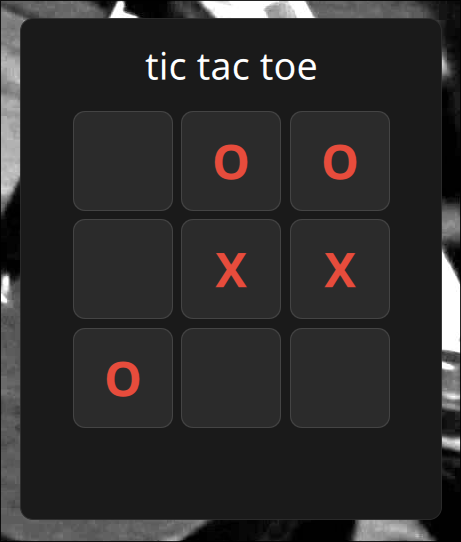

# Projeto integrador: matemática 1º bimestre.
Trabalho para a matéria de Projeto integrador de matemática do primeiro semestre do Bacharelado em ciência da computação da Universidade Tuiuti do Paraná.

